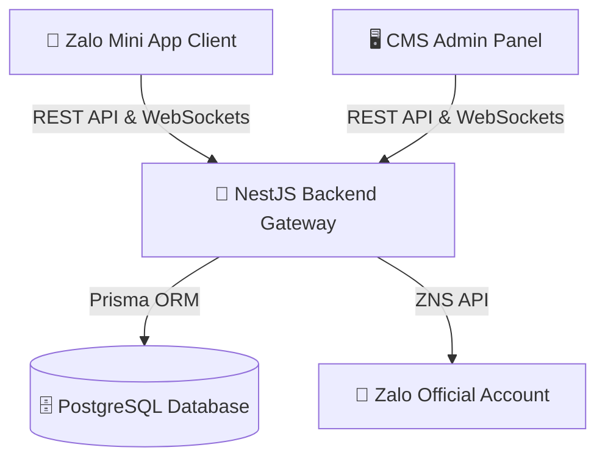

# 🎓 BÁO CÁO TỔNG QUAN KIẾN TRÚC & ĐIỂM NỔI BẬT KỸ THUẬT ĐỒ ÁN TỐT NGHIỆP
> **Tên đề tài:** Hệ Thống Thương Mại Điện Tử Zalo Mini App Kết Hợp Trợ Lý AI & Quản Trị Monorepo  
> **Tác giả:** Huỳnh Nhật Huy  
> **Công nghệ cốt lõi:** Monorepo (PNPM Workspaces), React, TypeScript, NestJS, Prisma ORM, PostgreSQL, Socket.IO, TailwindCSS  
> **Cập nhật:** 2026-07-22  

---

## 📌 1. TẠI SAO ĐỀ TÀI NÀY ĐẠT TIÊU CHUẨN ĐỒ ÁN XUẤT SẮC?
Khi Thầy/Cô Hướng dẫn hoặc Hội đồng chấm đồ án hỏi: *"Ứng dụng thương mại điện tử này có điểm gì đặc biệt và phức tạp hơn các trang web bán hàng thông thường?"*, bạn có thể tự tin trình bày **6 Trụ Cột Kỹ Thuật Chuyên Sâu** sau:

### 1️⃣ Kiến Trúc Monorepo Chuẩn Doanh Nghiệp (Monorepo Architecture - PNPM Workspaces)
- Không phải là một ứng dụng đơn lẻ (Monolith), hệ thống được thiết kế dưới dạng **Monorepo đa ứng dụng**:
  - `apps/zalo-mini-app`: Ứng dụng Zalo Mini App dành cho khách hàng (chạy trực tiếp trong hệ sinh thái Zalo).
  - `apps/cms`: Trang Quản trị doanh nghiệp (Admin / Merchant CMS).
  - `apps/backend`: API Gateway Server (NestJS, Prisma ORM, PostgreSQL).
  - `apps/www`: Trang giới thiệu thương hiệu & Landing Page.
- **Ưu điểm kiến trúc:** Chia sẻ mã nguồn TypeScript (Types, Interfaces, DTOs) giữa Client và Server, quản lý phụ thuộc tập trung, tăng tốc độ Build và CI/CD.

### 2️⃣ Trợ Lý AI Tư Vấn Phối Đồ & Tìm Kiếm Thông Minh (AI Smart Shopping Assistant & Stylist)
- Tích hợp **Trợ lý AI Phối đồ 24/7** trong Zalo Mini App hỗ trợ người dùng bằng ngôn ngữ tự nhiên:
  - Tư vấn bộ Outfit đi chơi, đi tiệc theo ngân sách.
  - Hướng dẫn bảng chọn Size quần áo chuẩn xác theo chiều cao & cân nặng.
  - Tự động hiển thị các thẻ sản phẩm gợi ý tương ứng trực tiếp trong bong bóng chat AI.

### 3️⃣ Thuật Toán Gợi Ý Cá Nhân Hóa (AI Personalization Engine)
- Hệ thống theo dõi hành vi người dùng (Analytics Tracking): Lượt xem sản phẩm, Thêm giỏ hàng, Lịch sử mua.
- Thuật toán Gợi ý cá nhân hóa (`/analytics/top-products`, `/recommendations`) đề xuất các sản phẩm đúng sở thích của từng tài khoản Zalo.

### 4️⃣ Tính Năng Chát Trực Tiếp Realtime Qua WebSockets (Socket.IO)
- Kết nối kênh chat thời gian thực giữa **Khách hàng trên Zalo Mini App** và **Nhân viên tư vấn trên CMS Admin**.
- Tự động truyền ngữ cảnh sản phẩm khách đang xem (`[PRODUCT_CONTEXT]`) giúp nhân viên CSKH tư vấn chính xác.

### 5️⃣ Hệ Thống Gamification Tích Điểm & Vòng Quay May Mắn (Loyalty Points & Lucky Wheel)
- Khách hàng quay thưởng nhận mã giảm giá Voucher.
- Tự động nâng hạng hội viên (Đồng, Bạc, Vàng, Kim Cương) theo tổng chi tiêu thực tế.
- Tự động tích lũy điểm thưởng mua sắm (1.000đ = 1 điểm).

### 6️⃣ Tự Động Đẩy Thông Báo Zalo OA (ZNS Push) & In Hóa Đơn Bán Lẻ
- Đẩy nhật ký thông báo Zalo Notification Service (ZNS) khi đơn hàng chuyển trạng thái (Đã duyệt ➔ Đang giao ➔ Hoàn thành).
- In hóa đơn bán lẻ chuẩn nhiệt (A4/A5) và Xuất báo cáo tài chính Excel 1 chạm.

---

## 📐 2. SƠ ĐỒ KIẾN TRÚC HỆ THỐNG (C4 MODEL & SEQUENCE DIAGRAM)

### Flow Thanh Toán & Xử Lý Đơn Hàng (Sequence Diagram):
1. **Khách hàng** tạo đơn hàng trên Zalo Mini App ➔ Gửi DTO tới `/orders` (Trạng thái: `PROCESSING`).
2. **Backend NestJS** thực hiện Transaction kiểm tra kho hàng (`ProductVariant`), trừ kho tự động, tích điểm thưởng `PointsHistory` và gửi notification.
3. **CMS Admin Panel** (Polling 30s) tự động hiển thị đơn hàng mới trên **Full-Width Dashboard Card**.
4. **Admin** bấm *"Bàn Giao Shipper"* ➔ Hệ thống cập nhật Mã vận đơn GHN, gửi ZNS Push tới Zalo khách hàng.

---

## 📊 3. THỐNG KÊ CƠ SỞ DỮ LIỆU (DATABASE SCHEMA - 15 BẢNG CHUẨN HOÀN THIỆN)
Hệ thống sử dụng PostgreSQL với **15 Bảng chuẩn hóa 3NF**:
- `User` (Thông tin tài khoản Zalo, Hạng thẻ, Điểm thưởng)
- `Order` & `OrderItem` (Chi tiết đơn hàng, Địa chỉ giao hàng, Mã vận đơn)
- `Product`, `ProductVariant`, `Category` (Sản phẩm, Phân loại màu/size, Danh mục)
- `Voucher` & `PointsHistory` (Mã giảm giá, Nhật ký tích điểm)
- `ChatMessage` (Lịch sử trò chuyện thời gian thực)
- `AnalyticsEvent` & `Notification` (Nhật ký hành vi & Thông báo)

---

## 🏆 4. BỘ CÂU HỎI & CÁCH TRẢ LỜI PHỤC VỤ BẢO VỆ ĐỒ ÁN
- **Hỏi:** *Tại sao lại chọn Zalo Mini App mà không làm App React Native/Flutter độc lập?*
  - **Trả lời:** Zalo Mini App giúp tận dụng hệ sinh thái 75+ triệu người dùng Zalo tại Việt Nam, không yêu cầu người dùng cài đặt ứng dụng mới, trải nghiệm tải tức thì (<1 giây) và tích hợp sẵn ZaloPay / Zalo OA.
- **Hỏi:** *Hệ thống xử lý bất đồng bộ và đồng bộ dữ liệu giữa CMS và App ra sao?*
  - **Trả lời:** Em sử dụng cơ chế Polling ngầm kết hợp WebSockets (Socket.IO) trên Backend NestJS, giúp CMS và App nhận trạng thái mới ngay lập tức mà không cần người dùng tải lại trang.

---
*Tài liệu này được tạo tự động để hỗ trợ báo cáo đồ án tốt nghiệp.*
